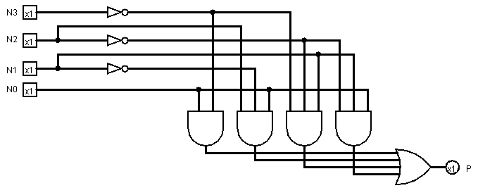
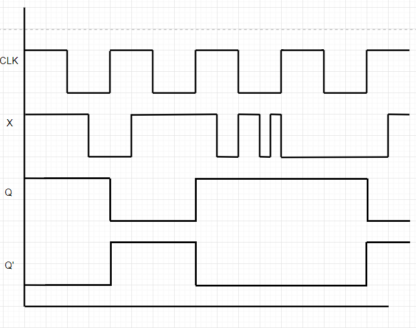

# COMP2611 Spring 2018 Homework 1
LIU Weiyang, 20413306 
<mailto:wliuax@connect.ust.hk> 

[TOC]

## Question 1: Data representation
### a) Signed int on 16 bits
I. 8CE~(16)~
- 2's complement = 0000 1000 1100 1110
- Decimal = 2254

II. -114~(10)~
- 2's complement = 1111 1111 1000 1110
- Hexadecimal = FF8E

### b) Signed int on 32 bits
I. BEAD~(16)~
- 2’s complement = 0000 0000 0000 0000 1011 1110 1010 1101
- Decimal = 48813

II. -357821~(10)~
- 2’s complement = 1111 1111 1111 1010 1000 1010 0100 0011
- Hexadecimal = FFFA8A43

### c) Floating point -- decimal to binary
I. -2843.625
$ 2843_{10} = \text{B1B}_{16} = \text{1011 0001 1011} \\
\begin{aligned} {-2843.625}_{10} &= {1011\space0001\space1011.101}_2 \\
&= {1.0110\space0011\space0111\space01}_2 \times 2^{11} \end{aligned} \\ \ \\
S = 1\text{, Significand} = 0110\space0011\space0111\space0100\space0000\space000 \\
\text{Biased Exponent} = 11_{10} + 127_{10} = 138_{10} = {1000\space1010}_2 $

Therefore, ${-2843.625}_{10} = 1\quad1000\space1010\quad0110\space0011\space0111\space0100\space0000\space000$

II. 0.085

\#|f|f $\times$ 2|Bit
:---|:---:|:---:|:---:
|0.085|0.17|0
|0.17|0.34|0
|0.34|0.68|0
0|0.68|1.36|1
1|0.36|0.72|0
2|0.72|1.44|1
3|0.44|0.88|0
...|...|...|...
22|0.72|1.44|1
23|0.44|0.88|**1**

(As $|0.88-1|<|0.88-0|$, we choose **1** as the last bit.)
$0.085_{10}={1.0101\space1100\space0010\space1000\space1111\space011}_2 \times 2^{-4} \\ \ \\
S = 0\text{, Significand} = 0101\space1100\space0010\space1000\space1111\space011 \\
\text{Biased Exponent} = {-4}_{10} + 127_{10} = 123_{10} = {0111\space1011}_2 $

Therefore, $0.085_{10} = 0\quad0111\space1011\quad0101\space1100\space0010\space1000\space1111\space011$

### d) Floating point -- binary to decimal
I. 0 1001 0011 11101100101110110110000

$ S = 0\text{, Exponent}= {1001\space0011}_2 = 147_{10} \\
\begin{aligned} \text{Significand}&={.1110\space1100\space1011\space1011\space0110\space000}_2 \\
&= .\text{ECBB6}_{16} \\
&= 14\times16^{-1} + 12\times16^{-2} + 11\times16^{-3} + 11\times16^{-4} + 6\times16^{-5}\\
&\approx .9247\end{aligned}\\ \ \\
\begin{aligned}&(-1)^S \times (1 + \text{Significand}) \times 2^{\text{Exponent} - \text{Bias}} \\
\approx &(-1)^0 \times 1.9247 \times 2^{147-127} \\
=&1.9247 \times 2^{20}\end{aligned}$

II. 1 0000 0000 11100000000000000000000

$ S = 1\text{, Exponent}= {0000\space0000}_2 = 0 \\
\begin{aligned} \text{Significand}&={.1110\space0000...000}_2 \\
&= .111_2 \\
&= .875 \end{aligned}\\ \ \\
\begin{aligned}&(-1)^S \times \text{Significand} \times 2^{-126} \\
=&(-1)^1 \times 0.875 \times 2^{-126} \\
=&-0.875 \times 2^{-126}\end{aligned}$

## Question 2: Boolean algebra
I.

$\begin{aligned}&AB+AB\overline{C}D+ABD\overline{E}+\overline{A}B\overline{C}E+\overline{A}\space\overline{B}\space\overline{C}E \\
=&AB + ACE(B+\overline{B})\\
=&AB+ACE \end{aligned} $

II.

$\begin{aligned}&\overline{A}B\overline{C}+\overline{A}BC+A\overline{B}C+AB\overline{C}+ABC \\
=&\overline{A}B(\overline{C}+C)+AC(\overline{B}+B)+AB\overline{C} \\
=&\overline{A}B+AC+AB\overline{C} \\
=&\overline{A}B+AC+ABC+AB\overline{C} \\
=&\overline{A}B+AB+AC \\
=&B+AC\end{aligned}$

III.

$\begin{aligned}&\overline{(\overline{AB+\overline{A}\space\overline{B}})(\overline{BC+\overline{B}\space\overline{C}})} \\
=&AB+\overline{A}\space\overline{B} + BC+\overline{B}\space\overline{C}\end{aligned}$

IV.

$\begin{aligned}&\overline{\overline{A\overline{AB}}\cdot\overline{B\overline{AB}}} \\
=&A\overline{AB}+B\overline{AB} \\
=&A(\overline{A}+\overline{B})+B(\overline{A}+\overline{B}) \\
=&A\overline{B}+B\overline{A}\end{aligned}$

## Question 3: Combinational logic
### a) Truth table
N~3~|N~2~|N~1~|N~0~|P
:---:|:---:|:---:|:---:|:---:
0|0|0|0|0
0|0|0|1|1
0|0|1|0|1
0|0|1|1|1
0|1|0|0|0
0|1|0|1|1
0|1|1|0|0
0|1|1|1|1
1|0|0|0|0
1|0|0|1|0
1|0|1|0|0
1|0|1|1|1
1|1|0|0|0
1|1|0|1|1
1|1|1|0|0
1|1|1|1|0

### b) Logic expression
$\begin{aligned}P=&\overline{N_3}\space\overline{N_2}\space\overline{N_1}\space N_0 + \overline{N_3}\space\overline{N_2}\space N_1\space\overline{N_0} +  \overline{N_3}\space\overline{N_2}\space N_1\space N_0 \\
+&\overline{N_3}\space N_2\space \overline{N_1}\space N_0 + \overline{N_3}\space N_2\space N_1\space N_0 + N_3\space \overline{N_2}\space N_1\space N_0 \\
+&N_3\space N_2\space \overline{N_1}\space N_0 \end{aligned} $

$ \begin{aligned}P=&(N_3+N_2+N_1+N_0)(N_3+\overline{N_2}+N_1+N_0) \\
&(N_3+\overline{N_2}+\overline{N_1}+N_0)(\overline{N_3}+N_2+N_1+N_0) \\
&(\overline{N_3}+N_2+N_1+\overline{N_0})(\overline{N_3}+N_2+\overline{N_1}+N_0) \\
&(\overline{N_3}+\overline{N_2}+N_1+N_0)(\overline{N_3}+\overline{N_2}+\overline{N_1}+N_0) \\
&(\overline{N_3}+\overline{N_2}+\overline{N_1}+\overline{N_0})\end{aligned} $

### c) Simplify with K-map
&nbsp;&nbsp;&nbsp;&nbsp;&nbsp;&nbsp;&nbsp;&nbsp;&nbsp;&nbsp;N~1~N~0~ N~3~N~2~|00  |01  |11  |10  
:---|:---:|:---:|:---:|:---:
**00**|0|1|1|1
**01**|0|1|1|0
**11**|0|1|0|0
**10**|0|0|1|0

$ P = \overline{N_3}N_0+N_2\overline{N_1}N_0+\overline{N_3}\space\overline{N_2}N_1+\overline{N_2}N_1N_0 $

### d) Implement with gates

## Question 4: Sequential logic
### a) S-R latch
I.

$X$|$Y$|$Q$|$\overline{Q}$
:---:|:---:|:---:|:---:
0|0|1|0
0|1|1|0
1|0|1|0
1|1|1|0

II. No, beacuse the value stored (Q) is always 1 and cannot be changed.

### b) D flip-flop
As it's positive edge trigged, its timing diagram is as follows:

